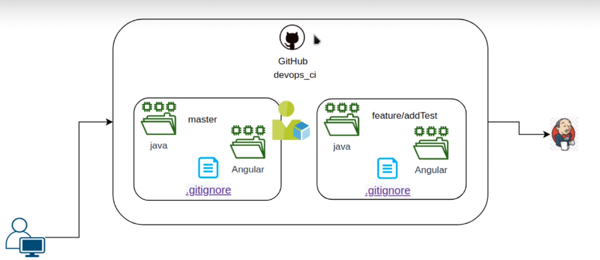
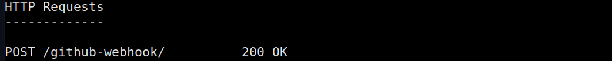
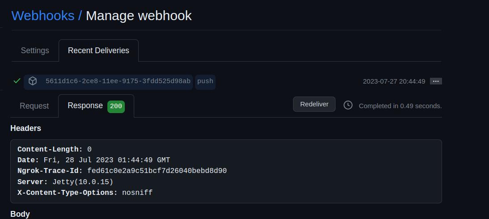
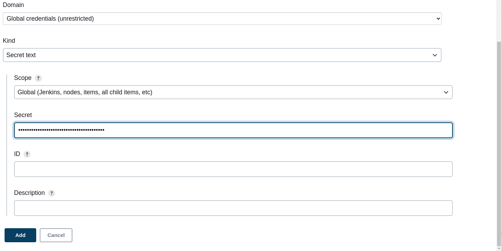
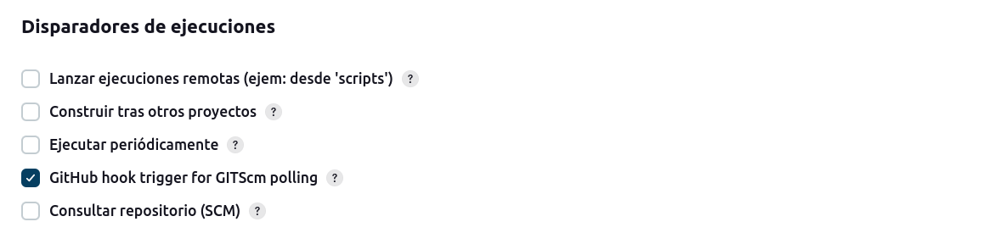

# Descripción

Este proyecto es usado como ejemplo de ci con pipeline y webhooks(en github) y [ngrook](https://ngrok.com/), con el objetivo de conectar y notificar el servidor de ci (jenkins),
con el repositorio remoto de manera automatico basado en eventos (push de commits, pull request entre otros) y ejecutar un pipeline cuando se envie la notificacion (con webhooks).



## Configuracion de webhook

1. Instalacion de ngrook ya que para usar webhooks se debe tener nuestro servidor de ci visible de internet y esta herramienta lo permite usando un proxy,
  para instalar usar https://ngrok.com/download.
```shell
# descargar via snap
 sudo snap install ngrok
```
2. Crear cuenta con ngrook se permite apartir de github
3. Seguir pasos de la pagina de ngrook una vez logueada su cuenta (copiar token, iniciar ngrook(se debe iniciar en el puerto donde corra el servidor de ci)).
4. Ahora se debera ir al webhook en github, para ello ir al repositorio especifico > settings > webhooks > add webhooks
5. Ahora se debe configurar el webhook, en payload url indicar la url https que otorga ngrok(es informacion sensible) via terminal a esto se le agrega el sufijo
   /github-webhook/ ej: https://xyz/github-webhook/, content type -> json y por ultimo indicar el evento a notificar en este caso seran commits, pero se puede
   indicar cualquier tipo de evento, pull request, creacion de ramas, etc. lo demas se deja por defecto.
6. Una vez configurado el webhook hara un evento de ping a nuestra ip, via consola se debe mostrar un 200. (si da 502 es porque el servidor de ci no lo reconoce o no esta desplegado)
7. Se crea la rama feature/addtest para visualizar notificacion, se visualizar en los webhooks y en la terminal de ngrok:

-

-

## Configuracion de pipeline con webhook

1. Tener inicializdo jenkins y acceder a el, adicionalmente el webhook configurado anteriormente debe estar corriendo correctamente
2. Ir a  panel de control > Administrar Jenkins >  System
3. Buscar seccion de github y agregar servidor, añadimos un nombre y dejamos la ruta exactamente igual
4. Presionar la opcion de Jenkins Credentials Provider, aqui configuramos lo sgte:



en secret debemos indicar el token de acceso personal generado en github o generar uno nuevo, posteriormente se prueba la conexion y se guarda.
5. Crear pipeline indicando ruta del repositorio, credenciales, rama que sera */feature/addtest el comodin para que identifique la rama ya que puede que empiece con origin/**, 
   tambien indicar pasos de construccion.
6. Se debe modificar el apartado de disparadores para que se ejecute automaticamente con el webhook y guardar el pipeline:

